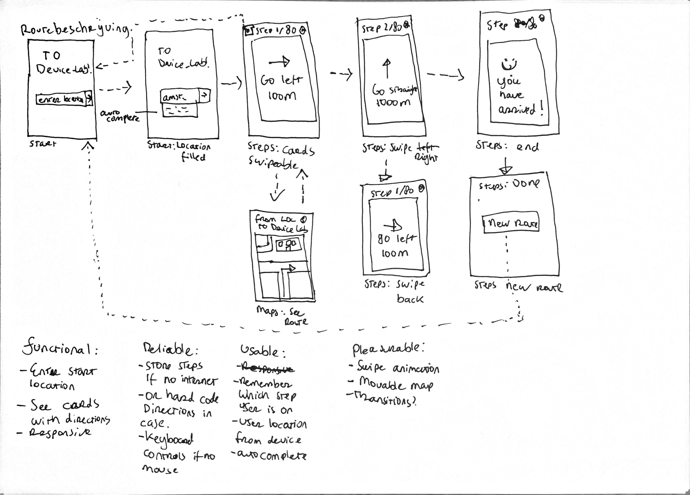

# Browser Technologies @cmda-minor-web 1920
//Robuuste, toegankelijke websites ontwerpen en maken …

In het vak Browser Technologies leer je hoe je goede, robuuste, toegankelijke websites maakt. Je gaat leren over Progressive Enhancement, Feature Detection en Fallback. Het web is er voor iedereen. In dit vak leer je hoe je daarvoor kan zorgen.

Een van de mooiste principes van het web is dat het er echt is voor iedereen. Iedereen met een computer en een browser moet gebruik kunnen maken van het web. Het web is geen gecontroleerde (programmeer) omgeving. Je kan er gerust van uit gaan dat niemand precies hetzelfde te zien krijgt als wat jij ziet in jouw browser. Er zijn natuurlijk de technische beperkingen. Zoals - Afmetingen van de browser - Grootte van het apparaat - Manier van interactie - Kwaliteit van de hardware - Kwaliteit van het netwerk. En er zijn mensen. Allemaal verschillende mensen ... Hoe zorg je er dan voor dat websites het altijd doen?
## Use Case
Ik wil de routebeschrijving van mijn huis tot aan het Device Lab stap voor stap kunnen zien.

## Installation
Clone this repo with your favourite GIT CLI or GUI.  
CD to the root of the project folder.  
Run ` npm install ` to install this project and its necessary dependencies.  

## Usage
Run `npm dev` and go to `localhost:3000` to see the dev version running with nodemon.  
Run `npm start` and go to `localhost:3000` to see the dev version running.

## Feedback week 2
Feedback over:
- Wireflow / Use case

<!-- Add a link to your live demo in Github Pages 🌐-->

<!-- ☝️ replace this description with a description of your own work -->

<!-- replace the code in the /docs folder with your own, so you can showcase your work with GitHub Pages 🌍 -->

<!-- Add a nice poster image here at the end of the week, showing off your shiny frontend 📸 -->

<!-- Maybe a table of contents here? 📚 -->

<!-- How about a section that describes how to install this project? 🤓 -->

<!-- ...but how does one use this project? What are its features 🤔 -->

<!-- Maybe a checklist of done stuff and stuff still on your wishlist? ✅ -->

<!-- How about a license here? 📜 (or is it a licence?) 🤷 -->
