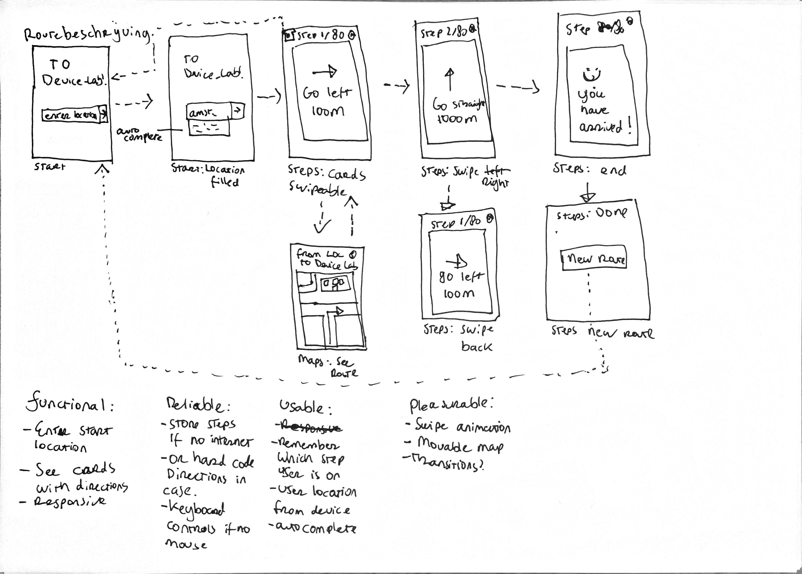

# Browser Technologies @cmda-minor-web 1920
Express app that shows the route from anywhere to the Device Lab!

## Use Case
Ik wil de routebeschrijving van mijn huis tot aan het Device Lab stap voor stap kunnen zien.

## Installation
Clone this repo with your favourite GIT CLI or GUI.  
CD to the root of the project folder.  
Run ` npm install ` to install this project and its necessary dependencies.  

## Usage
Run `npm dev` and go to `localhost:3000` to see the dev version running with nodemon.  
Run `npm start` and go to `localhost:3000` to see the dev version running.

## Feedback week 2
Feedback over:
- Wireflow / Use case

<!-- Add a link to your live demo in Github Pages 🌐-->

<!-- ☝️ replace this description with a description of your own work -->

<!-- replace the code in the /docs folder with your own, so you can showcase your work with GitHub Pages 🌍 -->

<!-- Add a nice poster image here at the end of the week, showing off your shiny frontend 📸 -->

<!-- Maybe a table of contents here? 📚 -->

<!-- How about a section that describes how to install this project? 🤓 -->

<!-- ...but how does one use this project? What are its features 🤔 -->

<!-- Maybe a checklist of done stuff and stuff still on your wishlist? ✅ -->

<!-- How about a license here? 📜 (or is it a licence?) 🤷 -->
