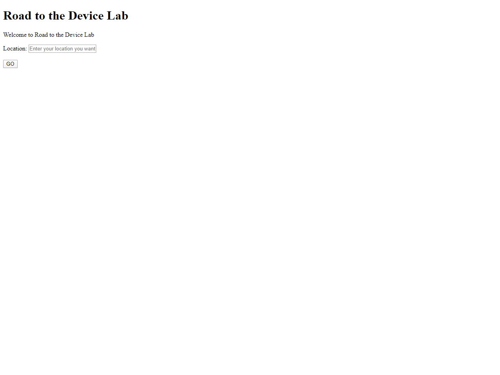
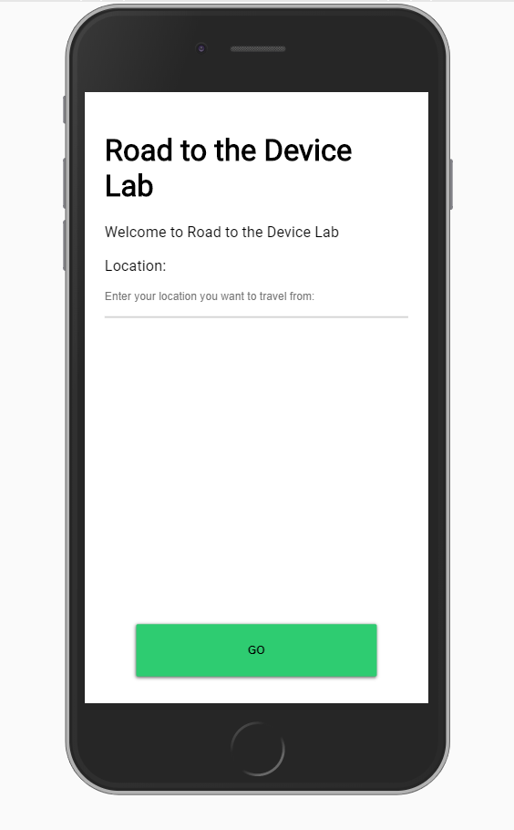
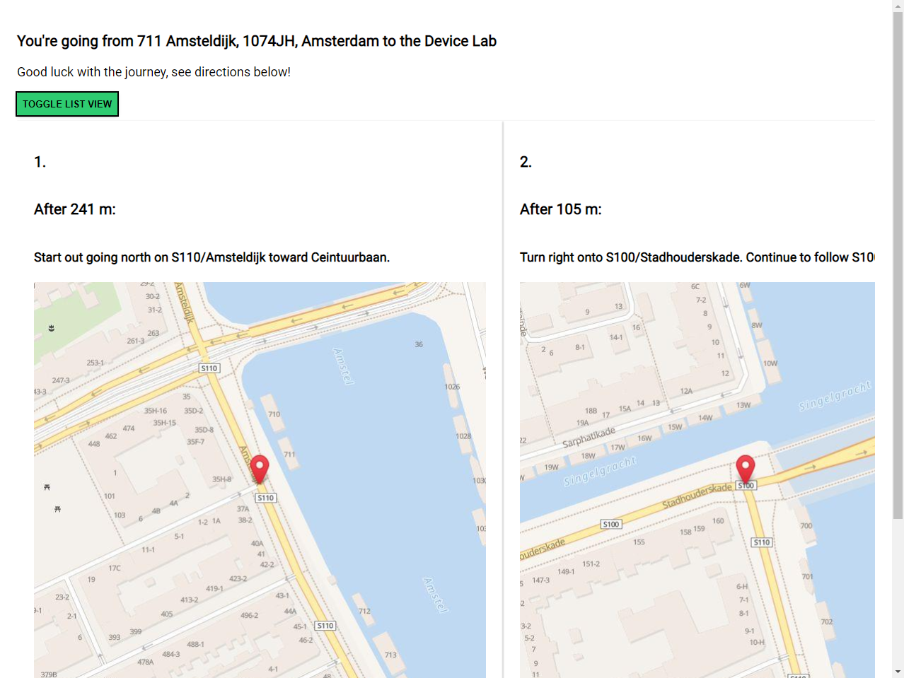

# Browser Technologies @cmda-minor-web 1920
Express app that shows the route from anywhere to the Device Lab!

[](https://travis-ci.com/tnanhekhan/browser-technologies-1920)


## Table of Contents
1. [Installation](#installation)
2. [Usage](#usage)
3. [Live Version](#live-version)
4. [Use Case](#use-case)  
5. [Built with](#built-with)  
6. [Conclusion](#conclusion)  


## Installation
Clone this repo with your favourite GIT CLI or GUI.  
CD to the root of the project folder.  
Run ` npm install ` to install this project and its necessary dependencies.  

## Usage
Run `npm dev` and go to `localhost:3000` to see the dev version running with nodemon.  
Run `npm start` and go to `localhost:3000` to see the dev version running.

## Live Version
Here is a link to the live version running on Heroku: https://road-to-device-lab.herokuapp.com/

## Use Case
The chosen use case for this course is "Ik wil de routebeschrijving van mijn huis tot aan het Device Lab stap voor stap kunnen zien."

The solution for this use case is an app where the user can enter a location by name or latitude & longitude. After the location is entered the user is presented by a directions that look like cards. Each of these cards represent a step from the directions fetched from an Api.


## Progressive Enhancement
### Functional / Reliable Layer
The functional / reliable layer is the app without Javascript and CSS. To attain this I have removed the stylesheet in the head of my html views and I have disabled Javascript in the browser through my adblocker.

The requirements for this layer have been changed a bit from the original of the wireflow. The only requirement for the functional / reliable layer is that you can enter a location and be shown your directions with a image of a map.
___
  
___


___
As you can see in the images above, the index still shows the bare minimum required for the functional / reliable layer. The input form for the location works as expected. The styling is also ugly as expected when you disable Javascript and CSS. Everything works fine.
___
  
___

___
The directions shown properly on the desktop version. However they are of course no cards because that is css dependant. The mobile version looks like the desktop version only cut off. Because the images are so large there is a lot of scrolling needed to be able to see all of the image. Everything works however, all the steps are shown and you can go back to the index page.

### Usable Layer
The usable layer is about styling and design. To make the site accessible and user friendly is the priority here.
___
  
___
  
___
The index now has a more readible font and large easy-to-click buttons. The button is also constrained to the bottom to give a more app-like feel.
___
  
___
  
___
  
___
The input form for location now has validation on it. Whenever you fill in an empty query,  the line of the input will be red. If the query is valid, then the line will be green. If you try to submit the form without filling anything in, the error message on the input will show.
___
  
___
  
___
For users that use the keyboard you can tab between all interactive elements. To make the focus effect a bit more obvious, the buttons have a black border whenever focused and the input field bottom border will be a bit darker to convey it has been focused on.
___
  
___
The directions now show in a card form to make the difference between directions a bit more clear. 

  
___
  
___
Whenever the direction card is hovered. It shows an material-like elevation effect. Whenever the direction card is focused on, it shows a glow effect.
___
  
___
For keyboard-only users you can also tab between directions now.
___

___
The mobile version has a vertical scroll with scroll-snap instead of a horizontal scroll 
### Pleasurable Layer
The pleasurable layer is the Javascript-enhanced version of the app with useful and interesting features.
___
  
___
  
___
The pleasurable index now has the option to get the latitude and the longitude of the device through the Javascript GeoLocation API.
___
  
___
 
___
The directions page now has button to switch between the mobile swipe view or the desktop list view on any device.
___
  
___
Whenever the swipe view is used, there is also an interactive stepper shown in the button to show which step of the directions the user is on. You can also scroll through views by clicking on a direction.


## Accessibility
### Disabling Images
___

___

The only images in the app are those static map images per direction step. Whenever images are disabled the alt text shows, so this works as intended.

### Disabling Custom Fonts
Disabling custom fonts doesn't break anything because I implemented a font fallback:

```css
body {
    font: 18px "roboto-regular", Helvetica, Arial, sans-serif;
}
```

### Disabling mouse / trackpad
As explained earlier all main elements like the directions, inputs and buttons are accessible without a keyboard by using Tab.

### Disabling Javascript
If javascript is disabled you can't use the GeoLocation functionality, you can't switch between swipe/list views and the stepper is not interactive. The main functionality still works fine.

### Disabling Cookies / LocalStorage
Disabling cookies / LocalStorage has no effect because these are not used.

### Color
 
___
 
___
 
___
 
___
All background and text combinations pass in terms of contrast.

## Feature Detection
A browser technology that is used for this project which might not work everywhere is [css-scroll-snap](https://developer.mozilla.org/en-US/docs/Web/CSS/scroll-snap-type). This is used for to ensure a direction is always centered when using the swipe view. If a browser does not support `css-scroll-snap` you can still scroll on the swipe view but it does not snap to an element anymore according to [MDN](https://developer.mozilla.org/en-US/docs/Web/CSS/CSS_Scroll_Snap/Browser_compat).

CSS support has been implemented for checking if a browser supports `flex`.  
```css
@supports (display:flex) {
    section > article {
        display: flex;
        flex-direction: column;
        justify-content: center;
    }
}
```
If `flex` is not supported there is this fallback which centers the `article` elements, a bit like the implementation above.
```css
section > article {
    margin: 0 auto;
}
```

Feature detection has also been implemented for the GeoLocation implementation. The GeoLocation button only appears if GeoLocation is supported. If GeoLocation is not supported the button does not appear.

```javascript
if (navigator.geolocation) {
    locationForm.insertAdjacentHTML("afterend", "<h2> OR </h2>\n <button class=\"location-button\">GET LOCATION FROM DEVICE</button>\n");
    document.addEventListener("click", event => {
        if (event.target && event.target.className === "location-button") {
            navigator.geolocation.getCurrentPosition(position => {
                locationInput.value = `${position.coords.latitude}, ${position.coords.longitude}`;
                locationInput.focus();
            });
        }
    })
}
```

### Browser Test
#### Chrome 80
Everything works like it is supposed to because this is the browser that was used while developing.
#### Firefox 74.0
___

___

___
On Firefox 74.0 the bold text in the button shows a bit weirdly. The location accept doesn't paste the latitude and longitude of the device immediately but after a few tries. Which is weird. 

Scrolling is incredibly smooth in Firefox compared to Chrome. Everything feels more responsive somehow. Everything works as expected.

#### Edge 18
___

___
Edge 18 uses system location permissions for the GeoLocation Api and not the browser. Which is interesting but also annoying because system location is disabled on my system.

Scrolling is smooth like firefox. 

```javascript
event.target.scrollIntoView({behavior: "smooth", block: "center", inline: "center"});
```
`scrollIntoView()` with smooth behavior as seen above doesn't seem to work on Edge 18. You can still scroll through views by clicking but it doesn't show an animation and instead just jumps immediately to the selected directions.

#### Chrome 80 (Samsung Galaxy S9 /w Android 10)
___

___

Interesting behaviour of Chrome 80 on a Samsung Galaxy S9 with Android 10 is that while the soft input is shown the go button is pushed up. This looks a bit weird but is possibly useful if you want to submit the location form without pressing the submit button on the soft input itself

It feels quite sluggish compared to the desktop version, scrolling doesn't feel as nice compared to using it on desktops. All functionality works however.

## Built With
- [MapQuest](https://developer.mapquest.com/) Directions API
- [LocationIQ](https://locationiq.com/) Map Images API
- [WebAIM Contrast Checker](https://webaim.org/resources/contrastchecker/) Contrast Checker

## Conclusion
### Browser Technologies
The core functionality of this use case was to show directions from anywhere to the HvA Device Lab @ Theo Thijssenhuis. This has been achieved in this demo. The api itself is a bit wonky to use so I have also implemented the alternative of the GeoLocation button. This GeoLocation implementation is also part of the pleasurable layer of this app. 

I though about accessibility by implementing tab-index behaviour for keyboard-only users and looked at contrast-ratios of text and background-color. The app is also responsive so you can use it on your phone.

### Progressive Enhancement
I have implemented the three layers: Functional/Reliable, Usable and the Pleasurable layer. 
The Functional/Reliable layer can be achieved by disabling both Javascript and Css. In this layer you can enter a location in the input and you get a list of directions and map images that show where the direction is.

The usable layer can be achieved by only disabling Javascript. In this layer the app has a unique layout for mobile phones with a horizontal scrollview. Tabbing between elements for keyboard-only users has been enhanced by implementing highlighting on the focused elements. Everything from the previous layer still works of course.


The pleasurable layer is the default layer with nothing disabled. Within this layer you can use the GeoLocation API to get the latitude and the longitude of your device instead of filling in the location you want by hand. You can switch between the swipe and list views of the directions on both desktop and mobile. Also whenever you are in the swipe mode, you have an interactive stepper which can be used to jump to a certain step.

### Feature Detection:
I have tested on multiple browsers and the only one that showed an something not working was on Edge 18 with the scrollIntoView() smooth behaviour. The animation itself was the only thing that was broken however, you can still jump between direction steps by clicking on them but without a fancy animation.

CSS @support was also implemented for the flex implementation of the direction steps. In case flex was not supported the browser fell back on `margin: 0 auto;` to atleast center te elements. Also if a browser does not support `css-scroll-snap` it fell back on the default browser behaviour by not being able to snap. 


