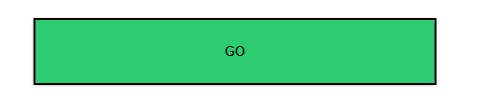
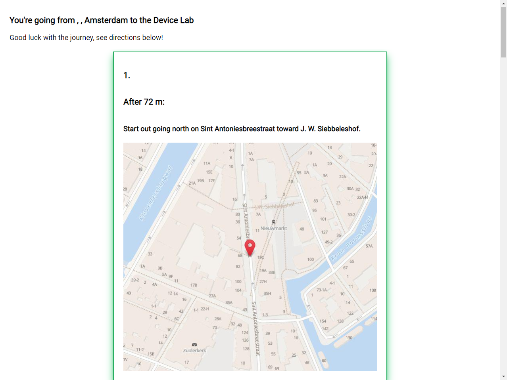

# Browser Technologies @cmda-minor-web 1920
Express app that shows the route from anywhere to the Device Lab!

[](https://travis-ci.com/tnanhekhan/browser-technologies-1920)


## Table of Contents
1. [Installation](#installation)
2. [Usage](#usage)
3. [Live Version](#live-version)
4. [Use Case](#use-case)  

## Installation
Clone this repo with your favourite GIT CLI or GUI.  
CD to the root of the project folder.  
Run ` npm install ` to install this project and its necessary dependencies.  

## Usage
Run `npm dev` and go to `localhost:3000` to see the dev version running with nodemon.  
Run `npm start` and go to `localhost:3000` to see the dev version running.

## Live Version
Here is a link to the live version running on Heroku: https://road-to-device-lab.herokuapp.com/

## Use Case
The chosen use case for this course is "Ik wil de routebeschrijving van mijn huis tot aan het Device Lab stap voor stap kunnen zien."


## Progressive Enhancement
### Functional / Reliable Layer
The functional / reliable layer is the app without Javascript and CSS. To attain this I have removed the stylesheet in the head of my html views and I have disabled Javascript in the browser through my adblocker.

The requirements for this layer have been changed a bit from the original of the wireflow. The only requirement for the functional / reliable layer is that you can enter a location and be shown your directions with a image of a map.
___
  


As you can see in the images above, the index still shows the bare minimum required for the functional / reliable layer. The input form for the location works as expected. The styling is also ugly as expected when you disable Javascript and CSS. Everything works fine.
___
  


The directions shown properly on the desktop version. However they are of course no cards because that is css dependant. The mobile version looks like the desktop version only cut off. Because the images are so large there is a lot of scrolling needed to be able to see all of the image. Everything works however, all the steps are shown and you can go back to the index page.

### Usable Layer
The usable layer is about styling and design. To make the site accessible and user friendly is the priority here.
___
  

  

The index now has a more readible font and large easy-to-click buttons. The button is also constrained to the bottom to give a more app-like feel.
___
  

  

  

The input form for location now has validation on it. Whenever you fill in an empty query,  the line of the input will be red. If the query is valid, then the line will be green. If you try to submit the form without filling anything in, the error message on the input will show.
___
  

  

For users that use the keyboard you can tab between all interactive elements. To make the focus effect a bit more obvious, the buttons have a black border whenever focused and the input field bottom border will be a bit darker to convey it has been focused on.
___
  

The directions now show in a card form to make the difference between directions a bit more clear. 

  

  

Whenever the direction card is hovered. It shows an material-like elevation effect. Whenever the direction card is focused on, it shows a glow effect.
___
  

For keyboard-only users you can also tab between directions now.
___


The mobile version has a vertical scroll with scroll-snap instead of a horizontal scroll 
### Pleasurable Layer
The pleasurable layer is the Javascript-enhanced version of the app with useful and interesting features.
___
  

  

The pleasurable index now has the option to get the latitude and the longitude of the device through the Javascript GeoLocation API.
___
  

 

The directions page now has button to switch between the mobile swipe view or the desktop list view on any device.
___
  

Whenever the swipe view is used, there is also an interactive stepper shown in the button to show which step of the directions the user is on. You can also scroll through views by clicking on a direction.


## Accessibility
All main elements like the directions, inputs and buttons are accessible without a keyboard by using Tab.

 

 

 

 

All background and text combinations pass in terms of contrast.
## Feature Detection
A browser technology that is used for this project which might not work everywhere is [css-scroll-snap](https://developer.mozilla.org/en-US/docs/Web/CSS/scroll-snap-type). This is used for to ensure a direction is always centered when using the swipe view.

CSS support has been implemented for checking if a browser supports `flex`.  
```css
@supports (display:flex) {
    section > article {
        display: flex;
        flex-direction: column;
        justify-content: center;
    }
}
```
If `flex` is not supported there is this fallback which centers the `article` elements, a bit like the implementation above.
```css
section > article {
    margin: 0 auto;
}
```

### Browser Test
#### Chrome 80
Everything works like it is supposed to because this is the browser that was used while developing.
#### Firefox 74.0


On Firefox 74.0 the bold text in the button shows a bit weirdly. The location accept doesn't paste the latitude and longitude of the device immediately but after a few tries. Which is weird. 

Scrolling is incredibly smooth in Firefox compared to Chrome. Everything feels more responsive somehow. Everything works as expected.

#### Edge 18


Edge 18 uses system location permissions for the GeoLocation Api and not the browser. Which is interesting but also annoying because system location is disabled on my system.

Scrolling is smooth like firefox. 

```javascript
event.target.scrollIntoView({behavior: "smooth", block: "center", inline: "center"});
```
`scrollIntoView()` with smooth behavior as seen above doesn't seem to work on Edge 18. You can still scroll through views by clicking but it doesn't show an animation and instead just jumps immediately to the selected directions.

## Conclusion


